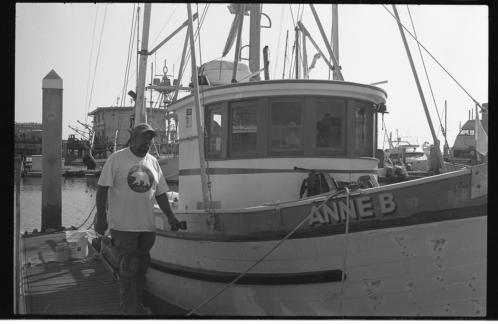
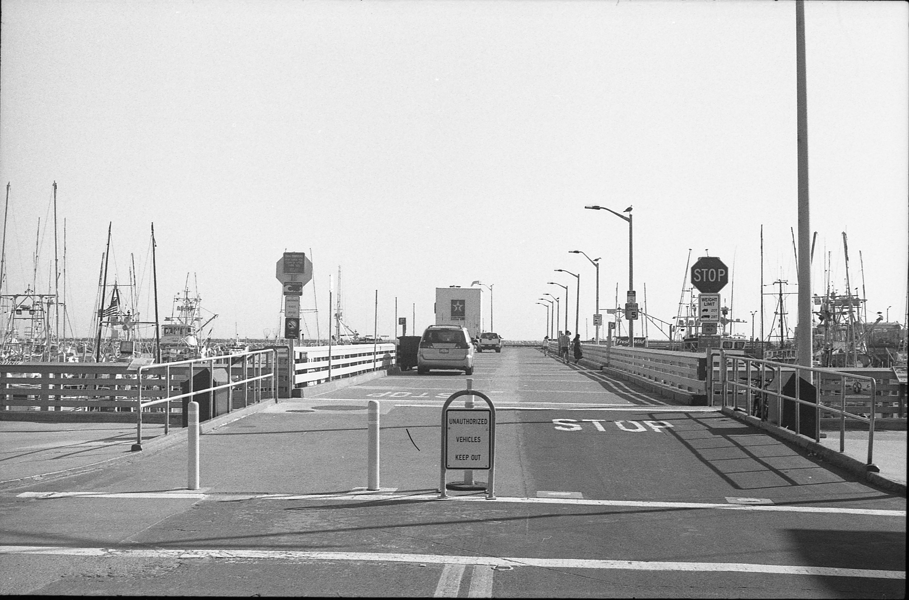

# Black and White Film and Digital Photgraphy Portfolio
I was born in Tokyo, Japan and I have been growing up here in Half Moon Bay for the longer part of 16 years.  I was never very far from the ocean and my mother made sure of it. Even, my name, Kai(海) means ocean in Japanese. The ocean was always part of my life, whether it was spending time at the beach or learning how to swim and kayak. When I was 5 years old, my parents got a divorce and I started living in two households. My father’s house, a orthodox suburban lifestyle, while my mother quickly took on a harbor life. 2 years later my mother got remarried to a fisherman. After that, when my step father wasn’t out commercial crabbing or fishing, he would from time to time take me and my mother out fishing. I remember the first time walking down the pier and onto the separate wooden paths to the boats. I could smell the mixture of fresh fish and sea water. But it would not be until I realize how significant the harbor would become. 
Around the start of freshman year of high school, my mother and step father decided to move us onto a boat. It was a big change of scenery and lifestyle. With all the changes that were happening in my life, I was becoming very frustrated. That is when my dad showed me film photography. I even learned the whole process of development of film and the printing of pictures. Fast forward to senior year, I had been getting very serious about photography by both incorporating film and digital photography. I wanted to start an independent project with it. So I started brainstorming ideas, thinking about what I want to represent and express with this project. That’s when I came up with this portfolio. I wanted to document the harbor, and as I was going through taking my first round of photos. I realized how big of a community lived and existed within the sea walls. They told me about the love they had for the job, the ups and downs, and just expressing the life they had built for themselves. The goal of this portfolio is that I can show the diamond in the rough of fishermen’s community in Half Moon Bay.

# Part 1: Harbor Personnel

</img>
 

# Part 2: Fishermen

</img>
 
</img>
 
</img>
 
</img>
 

# Part 3: Scenery

</img>
 
</img>
 
</img>
 
</img>
 
</img>
 
</img>
 

# Each photo on its own:

[Security Guards](img025.jpeg)
 
[Resting Fisherman](img050.jpeg)
 
[Alaskan Fisherman](img057.jpeg)
 
[Anne B Refurbrished](IMG_1814.JPG)
 
[Lifetime of Work](img051.jpeg)
 
[The Pier](img052.jpeg)
 
[Edge of the Harbor](img053.jpeg)
 
[Fishing Off the Rocks](IMG_1819.JPG)
 
[Ridge of the Rocks](IMG_1792.JPG)
 
[Beach Side of the Harbor](IMG_1789.JPG)
 
[Dreary Fog](IMG_1767.JPG)

Here is the link for [my portfolio](https://github.com/Kai-fujino-lin/Public-Photography-Portfolio/).
Also, I've included a QR code for easy sharing.

